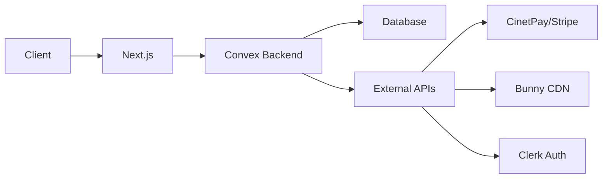

<div align="center">
  
  
  # FanTribe
  
  ### Plateforme Sociale pour Créateurs de Contenu
  
  Une plateforme française dédiée aux créateurs et créatrices permettant de monétiser leur contenu via des abonnements, avec support de paiement mobile money africain.

[](https://nextjs.org/)
[](https://www.typescriptlang.org/)
[](https://convex.dev/)
[](https://tailwindcss.com/)
[](LICENSE)

[Demo](#) · [Documentation](docs/) · [Signaler un Bug](https://github.com/RinKhimera/fantribe/issues) · [Demander une Fonctionnalité](https://github.com/RinKhimera/fantribe/issues)

</div>

---

## 📋 Table des Matières

- [✨ Fonctionnalités](#-fonctionnalités)
- [🎯 Pour Qui ?](#-pour-qui-)
- [🚀 Démarrage Rapide](#-démarrage-rapide)
- [🏗️ Architecture](#️-architecture)
- [💳 Paiements](#-paiements)
- [📱 Captures d'Écran](#-captures-décran)
- [🛠️ Stack Technique](#️-stack-technique)
- [📂 Structure du Projet](#-structure-du-projet)
- [🔐 Authentification & Sécurité](#-authentification--sécurité)
- [🎨 Design System](#-design-system)
- [📊 Dashboard Admin](#-dashboard-admin)
- [🧪 Mode Test](#-mode-test)
- [🌍 Déploiement](#-déploiement)
- [🤝 Contributing](#-contributing)
- [📝 License](#-license)
- [👨‍💻 Auteur](#-auteur)

---

## ✨ Fonctionnalités

### 🎨 Pour les Créateurs

- **Gestion de Contenu**
  - 📝 Publication de posts (texte, images, vidéos)
  - 🔒 Contenu public ou réservé aux abonnés
  - 💬 Système de commentaires et likes
  - 🔖 Collections personnalisées
  - 📊 Statistiques de performance

- **Monétisation**
  - 💰 Abonnements mensuels (1000 XAF/mois)
  - 📱 Paiement Mobile Money (Orange Money, MTN)
  - 💳 Paiement par carte (Stripe)
  - 📈 Suivi des revenus en temps réel
  - 🏆 Dashboard de performance

- **Vérification Créateur**
  - ✅ Processus de validation d'identité
  - 📄 Upload de documents officiels
  - 🔐 Sécurisation du compte
  - 🎖️ Badge de créateur vérifié

### 👥 Pour les Abonnés

- **Expérience Sociale**
  - 🏠 Fil d'actualité personnalisé
  - 🔍 Découverte de créateurs
  - ❤️ Interactions (likes, commentaires)
  - 💌 Messagerie privée avec créateurs
  - 🔔 Notifications en temps réel

- **Abonnements**
  - 📺 Accès au contenu exclusif
  - 💬 Messagerie directe avec créateurs
  - ⏰ Renouvellement automatique
  - 📊 Historique des abonnements

### 🛡️ Pour les Administrateurs

- **Dashboard Superuser**
  - 📊 Statistiques globales
  - 👤 Gestion des utilisateurs
  - 🎯 Modération de contenu
  - 💰 Suivi des transactions
  - 📈 Analyses de performance

- **Modération**
  - 🚨 Système de signalement
  - 👮 Validation des créateurs
  - 🔨 Actions de modération
  - 📧 Notifications automatiques

---

## 🎯 Pour Qui ?

### Créatrices & Créateurs

Artistes, influenceurs, coachs, éducateurs qui souhaitent monétiser leur contenu et construire une communauté engagée.

### Fans & Abonnés

Personnes souhaitant soutenir leurs créateurs favoris et accéder à du contenu exclusif.

### Marché Cible

Initialement conçu pour le marché francophone africain avec support natif du mobile money (Orange Money, MTN Mobile Money).

---

## 🚀 Démarrage Rapide

### Prérequis

Assurez-vous d'avoir installé :

- [Node.js](https://nodejs.org/en) (v18 ou supérieur)
- [Git](https://git-scm.com/)
- [npm](https://www.npmjs.com/) ou [bun](https://bun.sh/)
- Un compte [Convex](https://convex.dev/)
- Un compte [Clerk](https://clerk.com/)

### Installation

1. **Cloner le repository**

```bash
git clone https://github.com/RinKhimera/fantribe.git
cd fantribe
```

2. **Installer les dépendances**

```bash
npm install
# ou
bun install
```

3. **Configuration de l'environnement**

Créez un fichier `.env.local` à la racine :

```env
# Backend Convex
CONVEX_DEPLOYMENT=
NEXT_PUBLIC_CONVEX_URL=

# Authentification Clerk
NEXT_PUBLIC_CLERK_PUBLISHABLE_KEY=
CLERK_SECRET_KEY=
NEXT_PUBLIC_CLERK_SIGN_IN_URL=/auth/sign-in
NEXT_PUBLIC_CLERK_SIGN_UP_URL=/auth/sign-up

# Bunny CDN (Média)
NEXT_PUBLIC_BUNNY_VIDEO_LIBRARY_ID=
NEXT_PUBLIC_BUNNY_VIDEO_ACCESS_KEY=
NEXT_PUBLIC_BUNNY_STORAGE_ZONE_NAME=
NEXT_PUBLIC_BUNNY_STORAGE_ACCESS_KEY=
NEXT_PUBLIC_BUNNY_CDN_HOSTNAME=

# CinetPay (Mobile Money)
NEXT_PUBLIC_CINETPAY_SITE_ID=
NEXT_PUBLIC_CINETPAY_API_KEY=

# Stripe (Cartes)
NEXT_PUBLIC_STRIPE_PUBLISHABLE_KEY=
STRIPE_SECRET_KEY=
STRIPE_WEBHOOK_SECRET=
STRIPE_PRICE_ID=

# Email (Resend)
RESEND_API_KEY=
```

4. **Initialiser Convex**

```bash
npx convex dev
```

5. **Lancer le serveur de développement**

```bash
npm run dev
# ou
bun run dev
```

6. **Ouvrir l'application**

Naviguez vers [http://localhost:3000](http://localhost:3000)

---

## 🏗️ Architecture

### Pattern MVC Moderne

```
├── Frontend (Next.js 15)
│   ├── App Router (RSC)
│   ├── Client Components
│   └── Server Actions
│
├── Backend (Convex)
│   ├── Real-time Database
│   ├── Queries & Mutations
│   ├── Scheduled Jobs (Crons)
│   └── Webhooks
│
└── Services Externes
    ├── Clerk (Auth)
    ├── Bunny CDN (Média)
    ├── CinetPay (Mobile Money)
    ├── Stripe (Cartes)
    └── Resend (Email)
```

### Flux de Données



---

## 💳 Paiements

### Providers Supportés

#### 🇫🇷 CinetPay (Primaire)

- Orange Money
- MTN Mobile Money
- Moov Money
- Wave
- Paiement carte local

**Flux de paiement** :

1. Utilisateur sélectionne CinetPay
2. Redirection vers interface CinetPay
3. Choix du moyen de paiement
4. Confirmation mobile
5. Webhook de confirmation
6. Activation instantanée de l'abonnement

#### 💳 Stripe (Secondaire)

- Cartes Visa/Mastercard
- Apple Pay / Google Pay
- Pour utilisateurs internationaux

**Montant** : 1000 XAF/mois (~1.50€)

### Gestion des Abonnements

- **Durée** : 30 jours
- **Renouvellement** : Manuel (pas d'auto-renewal pour mobile money)
- **Types** :
  - `content_access` : Accès au contenu exclusif
  - `messaging_access` : Messagerie avec créateur
- **Statuts** :
  - `pending` : En attente de paiement
  - `active` : Actif
  - `expired` : Expiré (après 30 jours)
  - `canceled` : Annulé par l'utilisateur

---

## 📱 Captures d'Écran

<div align="center">
  
  
  
  
</div>

---

## 🛠️ Stack Technique

### Frontend

| Technologie         | Usage                   | Version |
| ------------------- | ----------------------- | ------- |
| **Next.js**         | Framework React         | 15.x    |
| **TypeScript**      | Typage statique         | 5.x     |
| **Tailwind CSS**    | Styling                 | 3.x     |
| **shadcn/ui**       | Composants UI           | Latest  |
| **Lucide React**    | Icônes                  | Latest  |
| **React Hook Form** | Gestion des formulaires | Latest  |
| **Zod**             | Validation              | Latest  |
| **date-fns**        | Manipulation dates      | Latest  |

### Backend & Services

| Service       | Usage                                    |
| ------------- | ---------------------------------------- |
| **Convex**    | Backend real-time, Database NoSQL        |
| **Clerk**     | Authentification (OAuth, Email/Password) |
| **Bunny CDN** | Stockage et streaming vidéo              |
| **CinetPay**  | Paiements mobile money africains         |
| **Stripe**    | Paiements par carte bancaire             |
| **Resend**    | Envoi d'emails transactionnels           |

### DevOps

- **Vercel** : Hosting & déploiement continu
- **GitHub Actions** : CI/CD (optionnel)
- **ESLint & Prettier** : Qualité du code

---

## 📂 Structure du Projet

```
fantribe/
├── app/                          # Next.js App Router
│   ├── (app-pages)/             # Pages authentifiées
│   │   ├── (superuser)/        # Routes admin
│   │   │   └── superuser/
│   │   │       ├── transactions/    # Dashboard transactions
│   │   │       ├── creator-applications/
│   │   │       └── reports/
│   │   ├── [username]/         # Profil utilisateur dynamique
│   │   ├── messages/           # Messagerie
│   │   ├── explore/            # Découverte
│   │   └── notifications/
│   ├── (auth)/                 # Authentification
│   └── api/                    # API Routes (webhooks)
│       ├── stripe/
│       ├── notification/       # CinetPay webhook
│       └── bunny/
│
├── components/                  # Composants React
│   ├── ui/                     # shadcn/ui components
│   ├── shared/                 # Composants partagés
│   ├── home/                   # Feed principal
│   ├── profile/                # Profil & abonnements
│   └── messages/               # Chat
│
├── convex/                     # Backend Convex
│   ├── schema.ts              # Schéma de la base de données
│   ├── users.ts               # Gestion utilisateurs
│   ├── posts.ts               # Publications
│   ├── subscriptions.ts       # Abonnements
│   ├── transactions.ts        # Paiements
│   ├── messages.ts            # Messagerie
│   ├── notifications.ts       # Notifications
│   ├── crons.ts               # Tâches planifiées
│   └── internalActions.ts     # Actions internes
│
├── hooks/                      # Custom React Hooks
├── lib/                        # Utilitaires
│   ├── bunny.ts               # SDK Bunny CDN
│   ├── logger.ts              # Logger structuré
│   └── utils.ts
│
├── schemas/                    # Schémas Zod
├── types/                      # Types TypeScript
├── actions/                    # Server Actions
└── docs/                       # Documentation
    ├── TRANSACTIONS_DASHBOARD_GUIDE.md
    ├── TEST_MODE_TRANSACTIONS.md
    ├── LOGGER_GUIDE.md
    └── ENV_GUIDE.md
```

---

## 🔐 Authentification & Sécurité

### Clerk Authentication

- **Méthodes** : Email/Mot de passe, OAuth (Google, Facebook)
- **Localisation** : Interface en français (`frFR`)
- **Onboarding** : Flow de complétion de profil
- **Token Exchange** : Convex ↔ Clerk via `tokenIdentifier`

### Types d'Utilisateurs

```typescript
accountType: "USER" | "CREATOR" | "SUPERUSER"
```

- **USER** : Utilisateur standard (peut s'abonner)
- **CREATOR** : Créateur vérifié (peut recevoir des abonnements)
- **SUPERUSER** : Administrateur (accès dashboard admin)

### Sécurité des Données

- ✅ Validation Zod côté client & serveur
- ✅ Authentification requise pour toutes les mutations
- ✅ Vérification des permissions (accountType)
- ✅ Filtrage des utilisateurs bloqués
- ✅ Sanitization des inputs utilisateur
- ✅ Rate limiting (Convex)
- ✅ HTTPS obligatoire en production

---

## 🎨 Design System

### Thème

- **Mode** : Light / Dark (système)
- **Couleurs** : Personnalisables via CSS variables
- **Font** : System fonts (optimisé performance)

### Composants UI

Basés sur [shadcn/ui](https://ui.shadcn.com/) :

- Button, Card, Dialog, Dropdown
- Form, Input, Select, Textarea
- Avatar, Badge, Separator
- Toast, Alert, Skeleton
- Table, Tabs, Tooltip

### Responsive Design

- **Mobile First** : Design pensé mobile d'abord
- **Breakpoints** :
  - `sm`: 640px
  - `md`: 768px
  - `lg`: 1024px
  - `xl`: 1280px

### Layout Pattern

```tsx
<ResponsiveLayout>
  <LeftSidebar /> {/* Navigation */}
  <MainContent /> {/* Feed, profil, etc. */}
  <RightSidebar /> {/* Suggestions, abonnement */}
</ResponsiveLayout>
```

---

## 📊 Dashboard Admin

### Accès

**URL** : `/superuser`  
**Permissions** : `accountType === "SUPERUSER"`

### Fonctionnalités

#### 📈 Statistiques Globales

- Nombre total d'utilisateurs
- Posts publiés
- Candidatures créateurs
- Taux d'approbation

#### 💰 Dashboard Transactions (`/superuser/transactions`)

**Filtres** :

- Période (2 semaines, 1 mois, 3 mois, 6 mois, 1 an)
- Créatrice spécifique
- Moyen de paiement (Stripe/CinetPay)

**Statistiques Affichées** :

- Revenu total de la période
- Nombre de transactions
- Créatrices actives
- Montant moyen par transaction
- Top 5 earners
- Low 5 earners

**Tableau Détaillé** :

- Date et heure
- Créatrice (avatar, nom, username)
- Abonné (avatar, nom, username)
- Moyen de paiement (badge)
- Devise
- Montant formaté

**Actions** :

- Export CSV (à venir)
- Filtrage avancé
- Tri des données

#### 🎯 Modération

- Validation des créateurs
- Signalements (posts, utilisateurs, commentaires)
- Actions de modération

---

Pour tester le dashboard sans données réelles :

**Fichier** : `app/(app-pages)/(superuser)/superuser/transactions/page.tsx`

```typescript
const USE_TEST_DATA = true // Mode test
```

**Données générées** :

- 30 transactions sur 2 semaines
- 5 créatrices fictives
- 6 abonnés fictifs
- Montants : 1000 XAF/transaction
- Providers : 70% CinetPay, 30% Stripe

**Désactivation** :

```typescript
const USE_TEST_DATA = false // Production
```

📖 **Guide complet** : [`docs/TEST_MODE_TRANSACTIONS.md`](docs/TEST_MODE_TRANSACTIONS.md)

---

## 🌍 Déploiement

### Vercel (Recommandé)

1. **Push sur GitHub**

```bash
git push origin main
```

2. **Importer dans Vercel**
   - Connecter le repository
   - Configurer les variables d'environnement
   - Déployer

3. **Configurer les Webhooks**
   - CinetPay → `https://votredomaine.com/api/notification`
   - Stripe → `https://votredomaine.com/api/stripe`

### Variables d'Environnement Production

⚠️ **IMPORTANT** : Désactiver le mode test avant le déploiement !

```typescript
// Dans transactions/page.tsx
const USE_TEST_DATA = false // ✅ PRODUCTION
```

### Convex Production

```bash
npx convex deploy
```

Configurez `CONVEX_DEPLOYMENT` avec l'URL de production.

---

## 🤝 Contributing

Les contributions sont les bienvenues ! Voici comment contribuer :

### 1. Fork le Projet

```bash
git clone https://github.com/votre-username/fantribe.git
```

### 2. Créer une Branche

```bash
git checkout -b feature/AmazingFeature
```

### 3. Commit vos Changements

```bash
git commit -m 'Add: Nouvelle fonctionnalité incroyable'
```

Utilisez les préfixes conventionnels :

- `Add:` Nouvelle fonctionnalité
- `Fix:` Correction de bug
- `Update:` Mise à jour
- `Refactor:` Refactorisation
- `Docs:` Documentation

### 4. Push vers la Branche

```bash
git push origin feature/AmazingFeature
```

### 5. Ouvrir une Pull Request

Décrivez clairement :

- Le problème résolu
- Les changements apportés
- Les tests effectués
- Les captures d'écran (si UI)

### Guidelines

- ✅ Code en TypeScript
- ✅ Suivre les conventions du projet
- ✅ Commenter le code complexe
- ✅ Tester localement avant PR
- ✅ UI en français
- ✅ Responsive design obligatoire

---

## 📝 License

Ce projet est sous licence **MIT**. Voir le fichier [LICENSE](LICENSE) pour plus de détails.

```
MIT License

Copyright (c) 2025 Samuel Pokam

Permission is hereby granted, free of charge, to any person obtaining a copy
of this software and associated documentation files...
```

---

## 👨‍💻 Auteur

<div align="center">
  
  
  **Samuel Pokam**
  
  Développeur Full Stack | Next.js & React Enthusiast
  
  [](https://github.com/RinKhimera)
  [](https://linkedin.com/in/samuel-pokam)
  [](https://twitter.com/RinKhimera)
  [](https://samuelpokam.com)
</div>

---

## 🙏 Remerciements

- [Next.js](https://nextjs.org/) - Framework React
- [Convex](https://convex.dev/) - Backend real-time
- [Clerk](https://clerk.com/) - Authentification
- [shadcn/ui](https://ui.shadcn.com/) - Composants UI
- [Bunny CDN](https://bunny.net/) - Stockage média
- [CinetPay](https://cinetpay.com/) - Paiements mobiles
- [Stripe](https://stripe.com/) - Paiements cartes

---

## 📞 Support

- 📧 Email : [dixiades@gmail.com](mailto:dixiades@gmail.com)
- 🐛 Issues : [GitHub Issues](https://github.com/RinKhimera/fantribe/issues)
- 💬 Discussions : [GitHub Discussions](https://github.com/RinKhimera/fantribe/discussions)

---

<div align="center">
  
  ### ⭐ Si vous aimez ce projet, donnez-lui une étoile !
  
  **FanTribe** - Construire une communauté, monétiser sa passion
  
  Made with ❤️
  
</div>
